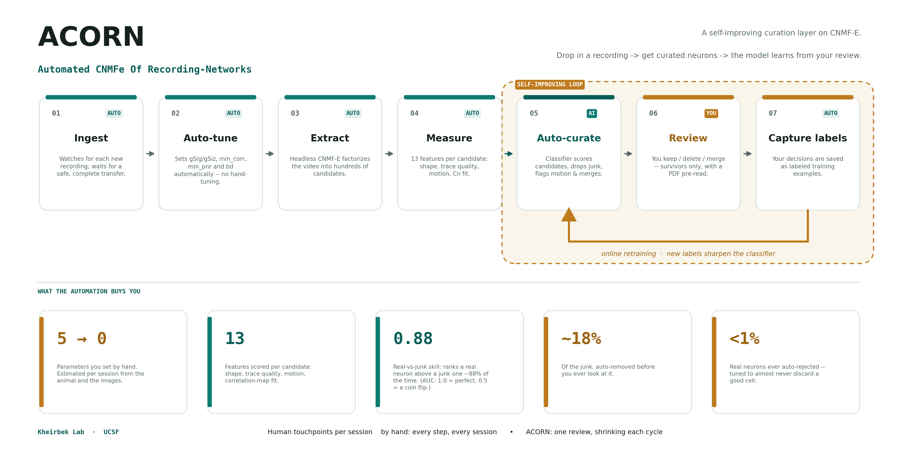

# Documentation

Docs for **ACORN — Automated CNMFe Of Recording-Networks**, the automation-assisted
curation layer this repository adds on top of CNMF-E.

_Click the figure for the print-resolution PDF, or open the [interactive version](acorn/acorn-schematic.html)._

## The system at a glance

- **[acorn/acorn-schematic.html](acorn/acorn-schematic.html)** — interactive schematic of the whole pipeline (open in a browser).
- **[acorn/acorn_schematic.pdf](acorn/acorn_schematic.pdf)** — the same figure as a print-resolution vector, for the manuscript / slides.
- **[acorn/acorn_schematic.png](acorn/acorn_schematic.png)** — a raster preview of the figure.
- **[acorn/make_acorn_figure.py](acorn/make_acorn_figure.py)** — regenerates the PDF/PNG (run in the `valence` env).

ACORN wraps CNMF-E with: automatic per-session parameter estimation, headless
extraction, a 13-feature XGBoost curator that pre-rejects confident junk and flags
motion / split-cell candidates, a short human review of the survivors, and
**online retraining** — every review sharpens the model, so the next session needs
less work. Reviewing distributes across a network of machines, one canonical model
per brain area.

## Setup & operation

- **[SETUP.md](SETUP.md)** — set up the repo on a new machine and run the pipeline (central machine: heavy compute + the single canonical model).
- **[REVIEW_SETUP.md](REVIEW_SETUP.md)** — the reviewer role: MATLAB-only, no Python. Pull a bundle, run the review, push it back.
- **[SETUP_INSTRUCTIONS.txt](SETUP_INSTRUCTIONS.txt)** — legacy setup notes, superseded by `SETUP.md` (kept for reference).

## Developer notes

- **[CURATOR_UPGRADE_2026-03.md](CURATOR_UPGRADE_2026-03.md)** — curator upgrade notes.
- **[MOTION_DETECTION_HANDOFF.md](MOTION_DETECTION_HANDOFF.md)** — motion-artifact detection R&D status.
- **[MOTION_AND_RESUMABLE_REVIEW_HANDOFF.md](MOTION_AND_RESUMABLE_REVIEW_HANDOFF.md)** — plans for wiring motion labels into the model and for resumable review.

> Links in these files that point at code (e.g. `../agent/...`) are written relative to
> this `docs/` folder.
